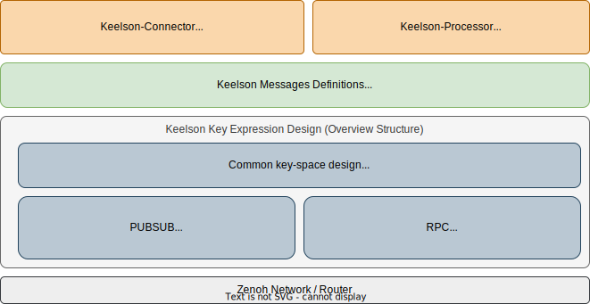
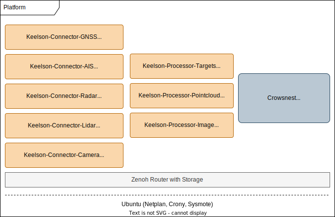

# Welcome to the documentation for `keelson`

> **NOTE**: Keelson is in the early phases of development and will undergo significant changes before reaching v1.0. Be aware!

`keelson` is a start towards an open maritime API specification designed for building distributed maritime applications on top of the Zenoh communication protocol (1). It is provided as free and open-source software under the Apache 2.0 License.
{ .annotate }

1.  In order to ease the introduction to keelson, make sure you are aquainted with zenoh. The following are some good resources:  
  
    * [What is Zenoh?](https://zenoh.io/docs/overview/what-is-zenoh/)  
    * [Zenoh in action](https://zenoh.io/docs/overview/zenoh-in-action/)  
    * [The basic abstractions](https://zenoh.io/docs/manual/abstractions/)  
    * [Zenoh: Unifying Communication, Storage and Computation from the Cloud to the Microcontroller](https://drive.google.com/file/d/1ETSLz2ouJ2o9OpVvEoXrbGcCvpF4TwJy/view?pli=1)
    * [Github repository](https://github.com/eclipse-zenoh/zenoh)

## What is a keelson?

A keelson is a longitudinal structure running above and fastened to the keel of a ship to strengthen its framework. `keelson`, the software, serves as the flexible and performant backbone for maritime data.

## What `keelson` offers

In short, to assist in developing distributed applications on top of zenoh, keelson has opinions and requirements about:

- The format of the key used when publishing data to zenoh
- The format of the data published to zenoh
- The format of the key used when declaring a queryable (i.e. RPC endpoint) in zenoh
- The format of the requests and responses exchanged via a queryable (i.e. RPC endpoint) in zenoh

For details about requirements on formats and message types, see the [protocol specification](./protocol-specification.md).

##  Why use `keelson`?

### Usage at RISE Maritime
`keelson` serves as RISE Maritime’s backbone for structuring a wide range of microservices, enabling the development of robust platforms for diverse maritime applications. Whether it’s a logging server, unmanned surface vehicle control system, remote control center, or any other maritime-related system, `keelson`'s modular architecture allows for flexible integration and scalability.

Most of what we do at RISE Maritime becomes open source software. Have a look at [RISE Maritime's GitHub page](https://github.com/RISE-Maritime) to explor various connectors, processors and other tools built using `keelson`.

